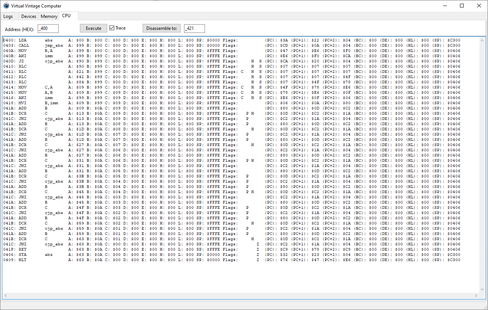
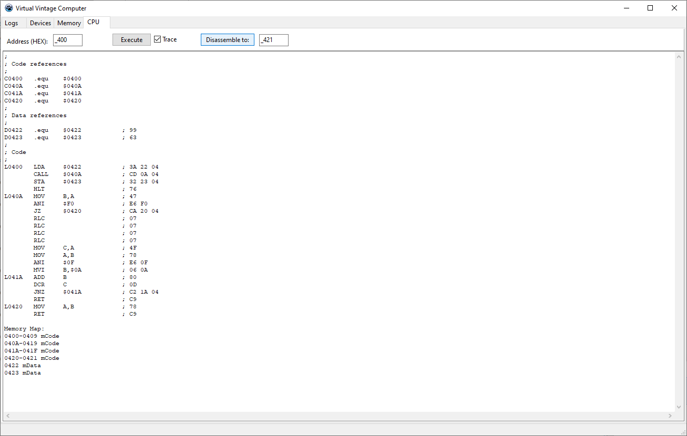

# Virtual Vintage Retro Computer

## Simulator of computer

CPU supported:
 - 8080 / 8085 with and without undocumented opcodes
 - 6502 with and without undocumented opcodes

Video Card supported:

Audio Card supported:

## Features

### Tracing

### Disassembling

